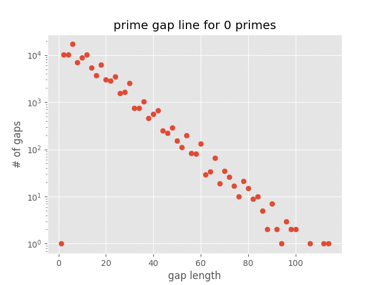

# Prime-gaps

Prime-gaps is a script that plots prime number gap line as in [this Mark Parker's video](https://www.youtube.com/watch?v=SMsTXQYgbiQ)

## Example output
<details>
  <summary>Click to expand</summary>
  
 
 
</details>

## Requirements
- [matplotlib](https://github.com/matplotlib/matplotlib)
- [primesieve](https://github.com/kimwalisch/primesieve-python)

## Usage
execute by typing this command in the terminal while being in the script's directory
```bash
python prime-gaps.py
```
for more information type
```bash
python prime-gaps.py --help
```

## License
[MIT](https://choosealicense.com/licenses/mit/)